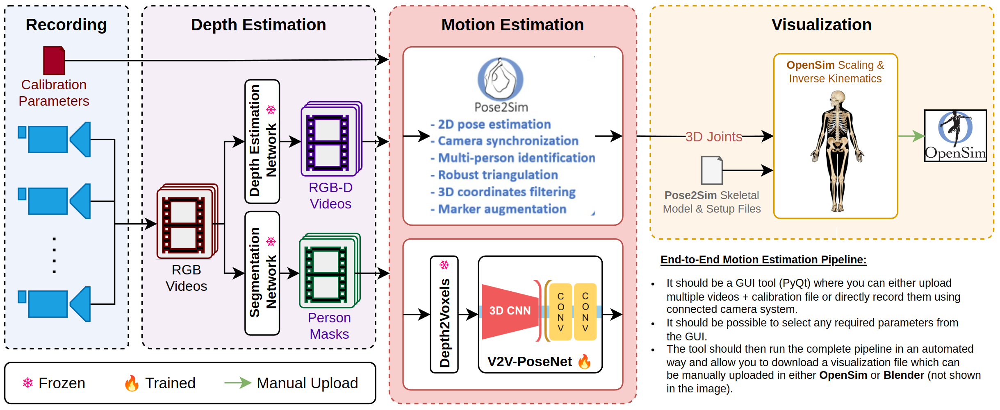

# MoCap Studio: An Advanced Optical Motion Capture Tool

**MoCap Studio** is an advanced tool designed for optical motion capture (MoCap) of human poses using one or more synchronized cameras. It supports full end-to-end motion capture pipelines, from video recording to 3D motion export for biomechanical analysis.

## Key Features

- **Synchronized Multi-Camera Recording**: Capture video streams from multiple cameras in a perfectly synchronized manner.
- **Camera Calibration**: Easily calibrate cameras using a chessboard pattern to ensure accurate depth and motion estimation.
- **Depth & Motion Estimation**: Leverage cutting-edge pose estimation networks for depth and motion capture.
- **3D Visualization**: Export 3D motion data to OpenSim for biomechanical simulations, or render it in 3D for visualization in tools like Blender.
- **Automated Workflow**: The tool provides a simple GUI, automating the entire pipeline from recording to visualization, making it accessible even for non-technical users.

## System Overview



## Installation

To get started, clone the repository and install the required dependencies.

### Prerequisites

In case of any missing libraries, you can install them using the following command:

```bash
sudo apt-get install build-essential python3-dev python3-tk libatlas-base-dev libfreetype6-dev
```

### Installation Steps

1. Clone the repository:

```bash
git clone https://github.com/your-repo/mocap-studio.git
cd mocap-studio
```

2. Install the package:

```bash
pip install -e .
```

_Tested on Ubuntu 22.04 with Python 3.10.12_

## Usage

### Camera Calibration

To run the camera calibration tool, use the following command:

```bash
mocap-calibrate
```

This tool will guide you through the process of calibrating the cameras using a chessboard pattern. Refer to the [user manual](./docs/calibration-manual.pdf) for more details.

### Launch MoCap Studio

To start the main GUI for the motion capture studio:

```bash
mocap-studio
```

## Contributing 

Contributions are very welcome. Open a fresh issue to start a discussion around a feature idea or a bug.

## Acknowledgments

The camera calibration tool is based on [MRT-Camera-Calibration-Toolbox](https://github.com/MT-MRT/MRT-Camera-Calibration-Toolbox). The MoCap Studio tool is developed by the Augmented Vision Group at the German Research Center for Artificial Intelligence (DFKI) by the following contributors:

- [Muhammad Saif Ullah Khan](https://github.com/saifkhichi96/)
- [Jeremias Krauss](#)

## Citation

Please use the following BibTeX entry to cite this repository:

```bibtex
@misc{mocap-studio,
  author = {Khan, Muhammad Saif Ullah and Krauss, Jeremias},
  title = {MoCap Studio: An Advanced Optical Motion Capture Tool},
  year = {2022},
  publisher = {GitHub},
  journal = {GitHub repository},
  howpublished = {\url{
```

Please also consider citing the following paper if you use the camera calibration tool:

```bibtex
@inproceedings{schramm2021multispectral,
  author  = {Schramm, Sebastian and Rangel, Johannes and Aguirre Salazar, Daniela and Schmoll, Robert and Kroll, Andreas},
  title   = {Multispectral Geometric Calibration of Cameras in Visual and Infrared Spectral Range},
  journal = {IEEE Sensors},
  year    = {2021},
  volume  = {21},
  number  = {2},
  pages   = {2159-2168},
  doi     = {10.1109/JSEN.2020.3019959},
  url     = {https://ieeexplore.ieee.org/document/9178752},
}
```

## Contact

If you have any questions, please email Saif Khan at muhammad_saif_ullah.khan@dfki.de.
