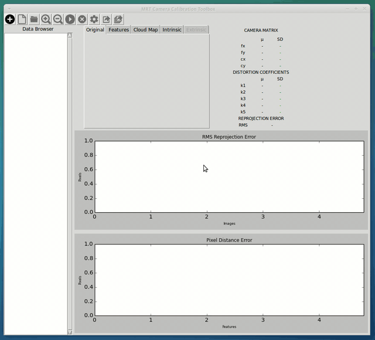

# MRT Camera Calibration Toolbox

## Introduction

The MRT Camera Calibration Toolbox is an application, developed in Python using OpenCV and tkinter, which determines the parameters of a camera's perspective projection by performing an intrinsic and extrinsic geometric calibration.

The application provides intrinsics, extrinsics and lens distortion parameters for each camera (two for stereo mode). For the stereo mode, the transformations between the individual camera coordinate systems are given as well. The information for each camera pose can be loaded using images or text files with the 2D points of the pattern. The calibration can be also made by using random subgroups from the total set of images. The computed parameters are the averaged over all iterations, and both the final results and the results per calibration can be exported to text files. 

## Reasons for using this Toolbox

-   Calibration of multispectral stereo camera systems
-   Calibration of camera systems with different resolutions
-   Visualization of the reprojection error
-   Image Cover Visibility
-   Statistical validation by means of calibration with subsets
-   Import and export of data
-   It's free!

## Requirements

To use the toolbox, the modules listed below have to be installed on your computer. 

-   Python3 (Tested for Python 3.4, Python 3.6 and Python 3.7)
-   OpenCV 4.2.0
-   tkinter 8.6
-   PIL 6.1.0
-   numpy 1.22.0
-   matplotlib 3.1.1

## Installation

You can download the source code and execute the toolbox [main.py](https://github.com/MT-MRT/MRT-Camera-Calibration-Toolbox/blob/master/main.py) directly on your computer through the Linux or Windows terminal:

```bash
cd path/to/your/toolbox
python3 main.py
```

## Getting Started

Check this animation of a running example of the MRT Camera Calibration Toolbox. 




## Citation

Please cite the following paper when using our toolbox it in your research project:
```BibTeX
@INPROCEEDINGS{Schramm2021,
  author  = {Schramm, Sebastian and Rangel, Johannes and Aguirre Salazar, Daniela and Schmoll, Robert and Kroll, Andreas},
  title   = {Multispectral Geometric Calibration of Cameras in Visual and Infrared Spectral Range},
  journal = {IEEE Sensors},
  year    = {2021},
  volume  = {21},
  number  = {2},
  pages   = {2159-2168},
  doi     = {10.1109/JSEN.2020.3019959},
  url     = {https://ieeexplore.ieee.org/document/9178752},
}
```

## Contact

If you have any questions, please email Daniela Aguirre Salazar at daguirres@unal.edu.co or Robert Schmoll at robert.schmoll@mrt.uni-kassel.de.
